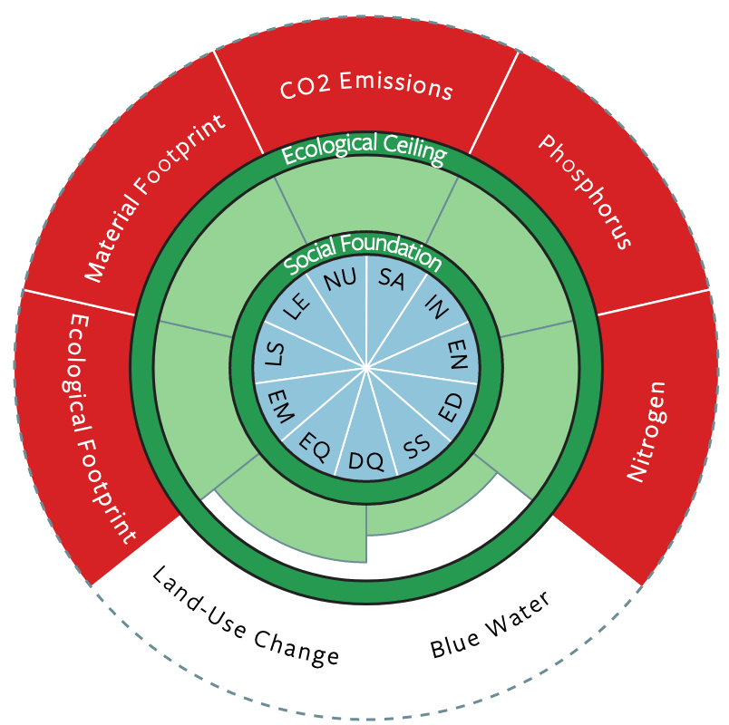
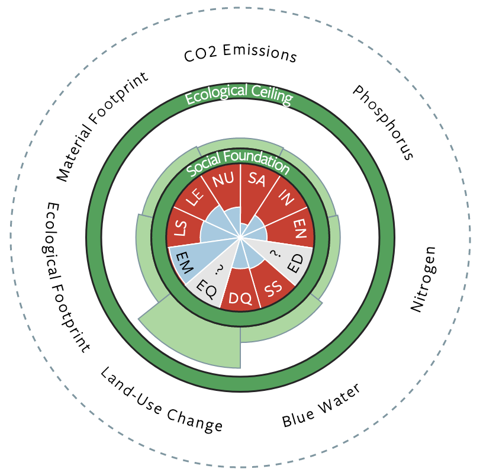

## Vantage point {.divider background-color="#00395B"}

::: {.secnum}
01
:::

<!-- =========================================================================
     EcolEcon26 L03b — Working with data. HTML (revealjs) version of the
     Keynote deck EcolEcon26_L03b_Data.key.

     WHAT IS DIFFERENT FROM THE KEYNOTE
     · The nine data figures are the SAME pipeline output as the Keynote, but
       regenerated: analysis/01_download.R was re-run on 17.09.2026 and
       analysis/02_figures.R rebuilt every figure. euf_style.R writes "svg"
       alongside "pdf" because an  cannot take a PDF — the Keynote keeps
       using the PDFs, this deck uses the SVGs, both vector, both from the
       same script on the same run. The SVGs carry their text as outlines, so
       they need no font at display time.
     · Publisher screenshots, book covers and portrait photographs of living
       people are NOT reproduced here. An HTML deck is far more likely to end
       up on the open web than a .key file, and those images were cleared for
       a lecture room, not for publication. They are replaced by typographic
       slides carrying the same argument and a full citation. The duck-rabbit
       (Fliegende Blätter, 1892, public domain) and the Leeds country
       doughnuts (CC BY, goodlife.leeds.ac.uk) are kept.
     · Everything else follows the Keynote slide for slide.

     Conventions come from the modernised master (same as RM26 / DevEcon26):
     assertion titles, .dek for nuance, 3-4 bullets, .source on every
     empirical claim.

     BODY COPY IS TELEGRAPHIC, NOT PROSE. Bullets, deks, boxes and column
     text are noun phrases — no running sentences, no sub-clauses to read out
     while the room is reading them too. The assertion titles are the one
     deliberate exception: they are full statements because that is what an
     assertion title is for, and they are shared with the other decks. The two
     Harding passages are verbatim quotations, trimmed with […] to the clauses
     the lecture actually uses.
     ========================================================================= -->

## Two problems, pulling against each other

::: {.dek}
Contested by every paradigm — except for the existence of both halves.
:::

::: {.columns .divided}
::: {.column width="50%"}
::: {.colhead .fragment}
The ecological challenge
:::

- Environmental stressors **beyond safe limits**

- Tipping points **close**

- Climate catastrophe a **realistic prospect**
:::

::: {.column width="50%"}
::: {.colhead .fragment}
The social challenge
:::

- A **highly unequal** world

- A large share of humanity **in poverty**

- **Very low living standards** for many more
:::
:::

::: {.arrow .lg .fragment}
**Social provisioning vs. ecological sustainability** — the twin challenge of this course
:::

## The same evidence, two opposite conclusions

::: {.dek}
Two serious, informed positions — on broadly the same numbers.
:::

::: {.columns .divided}
::: {.column width="50%"}
::: {.colhead .fragment}
Growth is necessary
:::

::: {.fragment}
"The reason that such **large economic growth is necessary** to reduce global
poverty is that the world is still very poor. […] those who don't see the
importance of growth are not aware of the extent of global poverty."

::: {.source}
Max Roser, *Our World in Data* [-@roser2021].
:::
:::
:::

::: {.column width="50%"}
::: {.colhead .fragment}
Growth is part of the problem
:::

::: {.fragment}
"In sum, it is **irrational to hope**, against the evidence, that our existing
[growth-based] economic system will deliver the development outcomes we want
while at the same time reversing ecological breakdown."

::: {.source}
Jason Hickel, *Degrowth: A response to Branko Milanovic* [-@hickel2020b].
:::
:::
:::
:::

::: {.arrow .xl .fragment}
How could we settle this empirically?
:::

## Observation is theory-laden

::: {.dek}
Not just interpretation — the vantage point decides what is in the picture.
:::

::: {.columns}
::: {.column width="45%"}
{width="85%" fig-alt="The duck-rabbit ambiguous figure"}

::: {.source}
*Fliegende Blätter*, 1892.
:::
:::

::: {.column width="55%"}
- A **duck** or a **rabbit** - depending on the perspective

- Different paradigms highlight different **influencing factors** and **implications**

- No call for relativism, but self-reflexive pluralism

- _Perspectival realism_ as the underlying philosophy
:::
:::

## Common data {.divider background-color="#00395B"}

::: {.secnum}
02
:::

## {.no-dash data-menu-title="Income grows, but in a very unequal fashion"}

{fig-align="center" width="86%" fig-alt="GDP per capita by world region, 1820 onwards"}

## {.no-dash data-menu-title="Income poverty remains a global problem"}

{fig-align="center" width="86%" fig-alt="Share of the world population below five poverty lines"}

## {.no-dash data-menu-title="There has been progress with respect to income poverty"}

{fig-align="center" width="86%" fig-alt="Long-run global poverty on two different measures"}

## {.no-dash data-menu-title="Reducing income poverty due to growth of GDP?!"}

{fig-align="center" width="84%" fig-alt="Share in extreme poverty against GDP per capita, by world region"}

## {.no-dash data-menu-title="GDP correlates with many development indicators"}

{fig-align="center" width="84%" fig-alt="Schooling, child mortality, literacy and doctors against GDP per capita"}

## {.no-dash data-menu-title="The extraction of raw materials keeps increasing"}

{fig-align="center" width="86%" fig-alt="Material extraction by material group and by world region"}

## {.no-dash data-menu-title="GDP correlates with energy use and with emissions"}

{fig-align="center" width="86%" fig-alt="Energy use and CO2 emissions per capita against GDP per capita"}

## {.no-dash data-menu-title="The question of decoupling"}

::: {.columns}
::: {.column width="72%"}
{width="100%" fig-alt="GDP and consumption-based CO2 per capita, indexed to 1990, for six countries"}
:::

::: {.column width="28%"}
- Emissions **easier to decouple** than raw materials

- **No substitutes** for many raw materials — phosphorus, for instance

- **Consumption-based** accounting: imported emissions count to the importer^[
  Different accounting methods allow taking into account also other combinations 
  of emissions, e.g. the emissions associated with the use of products, or the 
  emissions associate with value added. This will be discussed in a later session
  on accounting environmental stressors on the global level.]

:::
:::

## {.no-dash data-menu-title="Composite indicators also correlate with GDP"}

{fig-align="center" width="84%" fig-alt="HDI and Augmented HDI against GDP per capita"}

## Multi-dimensional indicators: a more comprehensive view

::: {.columns}
::: {.column width="50%"}
::: {.colhead}
Germany
:::

{width="72%" fig-alt="Doughnut diagram for Germany: social foundation largely met, several ecological ceilings overshot"}
:::

::: {.column width="50%"}
::: {.colhead}
Haiti
:::

{width="72%" fig-alt="Doughnut diagram for Haiti: ecological ceilings respected, social foundation largely unmet"}
:::
:::

::: {.source}
**Social foundation** — LS life satisfaction · LE healthy life expectancy ·
NU nutrition · SA sanitation · IN income · EN access to energy ·
ED education · SS social support · DQ democratic quality · EQ equality ·
EM employment. Red = shortfall (inner ring) or overshoot (outer ring).

O'Neill et al. [-@oneill2018]; country doughnuts from goodlife.leeds.ac.uk (CC BY).
:::

## {.no-dash data-menu-title="No country manages both at once"}

{fig-align="center" width="84%" fig-alt="Number of social thresholds achieved against number of biophysical boundaries transgressed, 91 countries, average 2011–2015. The top-left corner — no boundary transgressed, almost all thresholds met — is empty."}

## What follows from the empty corner

::: {.dek}
The Leeds group pushes the question past the scatter: which part of it is a
law, and which part is a provisioning system?
:::

::: {.grid3}
::: {.cap .fragment}
[What might be possible]{.caphead}

Physical needs — nutrition, sanitation, electricity, extreme poverty —
plausibly met for all within the boundaries
:::

::: {.cap .fragment}
[What looks hard]{.caphead}

Qualitative goals such as high life satisfaction: **2–6×** the sustainable
resource use, at current relationships
:::

::: {.cap .fragment}
[Where that leaves us]{.caphead}

The lever is the **provisioning system** — sufficiency and equity, not the
level of output
:::
:::

::: {.source}
O'Neill et al. [-@oneill2018]; Fanning et al. [-@fanning2022]; see also
Raworth [-@raworth2017].
:::

## Where that leaves the data

- The **twin challenge** is real — that much the data do establish

- What it implies for **future strategies**: not settled

- Your position depends on **which data**, **which interpretation**, **which
  mechanisms** — and on how those mechanisms change over time

::: {.keybox .fragment}
In your poster: as **comprehensive and balanced** as you can manage
:::

## Standpoint theory {.divider background-color="#00395B"}

::: {.secnum}
03
:::

## Which objectivity?

::: {.columns .divided}
::: {.column width="50%"}
::: {.colhead}
The classical / positivist ideal
:::

- Data seen from **"a view from nowhere"**

- **Value-free, objective** analysis as the aspiration

::: {.source}
Descartes; Nagel, *The View from Nowhere* (1986).
:::
:::

::: {.column width="50%"}
::: {.colhead}
The feminist and postcolonial critique
:::

- **Impossible** — knowledge is always **situated**

- Value-freedom yields only **weak objectivity**

- Often a disguised **"god trick"**

::: {.source}
Haraway; Harding [-@harding2015].
:::
:::
:::

## Bias shaped every stage, not just the conclusions

::: {.dek}
Harding's summary of what the feminist critique actually found.
:::

> […] **sexist and androcentric biases** had shaped virtually every stage of
> [these allegedly objective] research processes.
>
> They had shaped […] what could count as **interesting or important**
> scientific and technical problems, […] what counted as **relevant concepts**
> and hypotheses […] the design of research processes, what counted as
> relevant **evidence**, and the interpretation of data […]

::: {.source}
Sandra Harding, *Objectivity and Diversity* [-@harding2015, p. 30].
:::

## Strong objectivity is more objective, not less

::: {.dek}
Not abandoning objectivity — no longer confusing it with value-freedom.
:::

> Objective research should be fair to the evidence, fair to one's critics, and
> fair to the most severe criticisms one can imagine […]
>
> Thus, **"strong objectivity"** is faithful to the central commitments of the
> standard view in spite of its rejection of the value-free ideal. […] it is
> **"real objectivity"** […]

::: {.source}
Sandra Harding, *Objectivity and Diversity* [-@harding2015, p. 33].
:::

## Standpoint methodology is a route to strong objectivity

::: {.dek}
Not "the marginalised are right". Rather: a deliberate procedure against your
own blind spots.
:::

- Take in **different standpoints**, especially those outside the mainstream

- Views from the margins: **not** automatically "more valid"

- But: a guard against **intellectual lock-ins**, and a way to expose **blind
  spots**

::: {.arrow .lg .fragment}
Different standpoints in your poster, too
:::

## Your turn {.divider background-color="#00395B"}

::: {.secnum}
04
:::

## Your task

::: {.taskbox style="margin-top: 1.4em;"}
**Country groups** · **35 minutes**

From the data sources in this presentation: **development, poverty and
environmental impact** for your country

Then: a **short presentation (2–4 minutes)** to the other groups
:::

::: {.arrow .fragment}
Not just the numbers — two readings of them
:::

::: {#task-timer .timer seconds="2100" starton="interaction"}
:::

## What your presentation has to do

::: {.nonincremental}
- **Two interpretations** of your data, from **different paradigmatic
  viewpoints**

- Related to the **twin challenge**: social provisioning against ecological
  sustainability

- **Key lessons** for your fellow students — including the ones about the data
  itself
:::

::: {.keybox .fragment}
Note every judgement call — which year, which indicator, which source. And the theory that justifies it.
:::

## Summary and outlook

- Development and environment: a **twin challenge**, social and ecological

- A **wide array** of indicators — and they disagree

- **Observation is theory-laden**: choice of indicators, and their assessment,
  follow the vantage point

- Vantage points track the general approaches: modernisation, Marxism,
  dependency, post-development

- **Goal:** the twin challenge approached in a pluralist way — comprehensive
  and balanced

::: {.keybox .fragment}
Never neutral — but **explicit** and **self-reflexive**
:::

## References {.smaller .scrollable}

::: {#refs}
:::

<!-- End of deck. 26 slides against the Keynote's 24: the O'Neill scatter
     became a typographic slide of its own, and the task slide was split in
     two so the "two interpretations" requirement is not buried in a
     sub-bullet.

     To refresh the figures before the lecture:
         Rscript analysis/01_download.R && Rscript analysis/02_figures.R
     then re-render this deck. The SVGs in slides/figures/ are copies — see
     the note in analysis/README.md. -->
